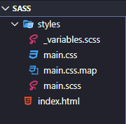
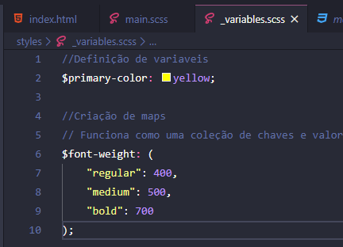

# :nail_care: Sass-lang

**Qual material estou usando?**

- **Canal do Emerson Broga**

[Aprenda a utilizar SASS em seus projetos](https://www.youtube.com/watch?v=C8KlabGtE8Y&t=3010s)

---

### Anotações sobre o Sass:

- **Precisamos baixar o Plugin: Live Sass Compiler**
- **O main.scss é o arquivo principal**

---

- **É possível e muito pratico usar variáveis com Sass:**

```scss
main.scss
//Definição de variaveis
$primary-color: yellow;

//Parametros
body {
  background-color: blueviolet;
  color: whitesmoke ;
  h1 {
    color: $primary-color;
  }
  a {
      color: $primary-color;
  }
}
```

---

- **Criação de maps:**

```scss
//Criação de maps
// Funciona como uma coleção de chaves e valores dentro do Sass
$font-weight: (
    "regular": 400,
    "medium": 500,
    "bold": 700
);

//Parametros
body {
  background-color: blueviolet;
  color: whitesmoke ;
  h1 {
    color: $primary-color;
    font-weight: map-get($font-weight, bold );
  }
```

---

- **Aquivos parciais:**
*São arquivos onde posso segmentar os elementos.
Ex:  `_variables.scss` onde `_` impede o sass compiler a criar um novo arquivo*

    

    *Dentro de `_variables.scss` eu trabalho com a variáveis:*

    

    *Em seguida eu as importo ao meu `main.scss`*

    ```scss
    @import './variables';

    //Parametros
    body {
      background-color: blueviolet;
      color: whitesmoke ;
      h1 {
        color: $primary-color;
        font-weight: map-get($font-weight, bold );
      }
      a {
          color: $primary-color;
      }
    }
    ```

    ---

- **Trabalhando com Funções:**

    ```scss
    main.scss
    [...]
    @function weight($key){
        @return map-get($font-weight, $key )
    };

    //Parametros
    body {
      background-color: blueviolet;
      color: whitesmoke ;
      h1 {
        color: $primary-color;
        font-weight: weight(bold);
      }
    [...]
    ```

    ---

- **Trabalhando com Mixins:**

    *É um trecho de código que poderá ser repetido dentro dos estilos.*

    ```scss
    main.scss
    [...]
    //Mixins
    @mixin flexCenter {
      display: flex;
      justify-content: center;
      align-items: center;
    }

    //Parametros
    body {
      background-color: blueviolet;
      color: whitesmoke;
      .container {
          @include flexCenter();
          flex-direction: column;
        h1 {
          color: $primary-color;
          font-weight: weight(bold);
        }
        a {
          color: $primary-color;
        }
      }
    [...]
    ```

    Passando variável via Mixin:

    ```scss
    main.scss
    [...]
    //Mixins
    @mixin flexCenter($direction) {
      display: flex;
      justify-content: center;
      align-items: center;
      flex-direction: $direction;
    }

    //Parametros
    body {
      background-color: blueviolet;
      color: whitesmoke;
      .container {
          @include flexCenter(column);
        h1 {
          color: $primary-color;
          font-weight: weight(bold);
        }
        a {
          color: $primary-color;
        }
      }
    [...]
    ```